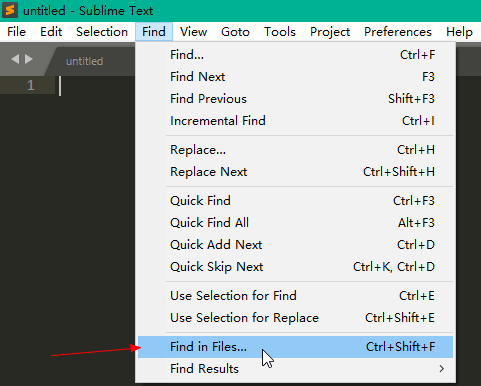

[TOC]

# 一、全局搜索

由于我们平时要开发的功能大部分都可以在费控系统中找到参考，这时全局搜索就可以帮我们找到这些参考。

例如，当你要实现下拉框的功能时，就可以全局搜索 `ComboBox`，这样你就可以借鉴前人实现`ComboBox`的过程。

那么如何进行全局搜索呢？见如下过程：

## 1. 安装 Sublime Text 3

百度搜索 Sublime Text 3，一路默认安装即可。

## 2. 全局搜索

`Find` -> `Find in Files...`

